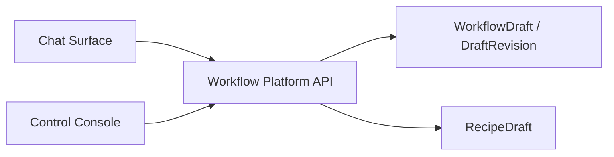

# 02 Architecture

## Context & current state
- 当前 repo 只有聊天入口和 timeline 体验，没有正式的 workflow builder control-plane object。
- 如果 chat surface 与 control console 各自产生本地草稿，后续模板发布、审计、recipe 晋升都会失去统一 lineage。
- `T-012` 已规定所有 workflow 命令和查询都由 `workflow-platform-api` 统一承接；`T-013` 已规定 authoritative store 不能由 UI projection 反向充当。

## Proposed design

### Control-plane draft inventory
| Object | Role | Notes |
|---|---|---|
| `WorkflowDraft` | 一个 draft line 的控制面对象与单一事实源 | 可由 chat 或 console 读写；publish 后冻结 |
| `DraftRevision` | append-only 的变更快照与校验结果 | 支持审计与顺序化修订，不引入首版 merge/conflict |
| `RecipeDraft` | 从 run/evidence 收敛出的可复用分析 recipe 草稿 | 不是聊天消息，不是 runtime projection |
| `DraftSource` | 标记来源：chat intake、console edit、run-derived recipe 等 | 用于 lineage，不是用户可见主对象 |

### Why `WorkflowDraft` and `RecipeDraft` stay separate
- `WorkflowDraft` 的目标是产出 `WorkflowTemplateVersion`。
- `RecipeDraft` 的目标是沉淀可复用分析配方，并在后续进入 capability/preset 晋升路径。
- 两者虽然都属于 control-plane draft objects，但来源、生命周期、审计重点和晋升目标不同。
- 因此首版保持两个逻辑对象，避免为了复用存储形态而提前混淆语义。

### Draft lifecycle
```ts
type DraftStatus =
  | "created"
  | "collecting_input"
  | "synthesized"
  | "editable"
  | "validating"
  | "publishable"
  | "published"
  | "superseded"
  | "archived";
```

```ts
type RecipeDraftStatus =
  | "captured"
  | "structured"
  | "review_required"
  | "approved_for_promotion"
  | "promoted"
  | "rejected"
  | "archived";
```

### Dual-entry model


#### Ownership rules
- chat surface 只能创建/续写 draft command，不能持有本地 authoritative draft。
- control console 只能编辑/校验/发布同一 draft object，不能导出为另一套未注册草稿。
- platform API 持有 draft command validation、revision append、risk evaluation。
- 双入口保持数据对称：
  - chat surface 和 control console 读写同一个 `WorkflowDraft` / `DraftRevision`
  - 不允许任何一端形成独立数据副本或本地正式草稿
- 双入口保持能力与权限不对称：
  - chat surface 偏 `intake / append requirement / request synthesis / light patch`
  - control console 偏 `inspect / structured edit / validate / publish / privileged action request`

### Command paths
- chat entry:
  - `start builder intake`
  - `append requirement`
  - `request synthesis`
  - `request publishability check`
- console entry:
  - `edit spec section`
  - `apply validation fix`
  - `request publish`
  - `request activation/binding`
- all commands land on `workflow-platform-api`, then persist to control-plane draft objects

### Draft-line semantics
- 一个 `WorkflowDraft` 代表一条 draft line。
- 一条 draft line 下可以有多条 `DraftRevision`。
- `DraftRevision` 首版采用 append-only revision log：
  - 每次编辑、合成、校验修复都追加一条新 revision
  - 不在首版引入跨 revision 的 merge/conflict resolution 语义
  - 需要协作时，以顺序化修订和审计为主，而不是并行分支合并
- `publish` 的语义是：
  - 冻结当前 draft line
  - 以某个已校验 revision 产出 `WorkflowTemplateVersion`
  - 当前 draft line 进入不可继续编辑状态
- 后续继续演化时：
  - 从已发布的 `WorkflowTemplateVersion` 或上一条 draft line 派生新的 `WorkflowDraft`
  - 新 draft line 拥有新的 revision 序列
  - 原 draft line 保留为审计、diff 和回溯依据
- 首版 lineage 锚点采用 `basedOnTemplateVersionRef`：
  - 新 draft line 明确指向它基于哪个已发布 `WorkflowTemplateVersion`
  - 不要求首版支持从未发布 draft line 直接 fork 的 branch 模式
- 若后续真的需要并行草稿分支，再增补可选字段 `forkedFromDraftRef`

### Why publish should close the current draft line
- 已发布版本不能被后续编辑悄悄改写。
- review、validation、publish 上下文需要绑定到确定的一条 draft line。
- 后续探索和改版应形成新的 lineage，而不是污染已发布 line。
- 这样更容易回答：
  - “发布时到底是哪一版”
  - “v2 是基于哪个已发布版本演化出来的”
  - “哪些 review/validation 记录属于哪个版本前的草稿线”

### Risk layering matrix
| Action | Meaning | Default governance |
|---|---|---|
| `publish template` | 将 draft 固化为 template/version，可被查看和复用 | low-risk, allowed broadly |
| `activate capability` | 让模板可被长期触发或自动运行 | gated |
| `bind secret/connector` | 绑定高权限外部能力 | gated |
| `enable schedule` | 允许定时或后台自动触发 | gated |
| `allow external write` | 允许对外部系统产生副作用 | gated |

### Recipe draft lineage
- `RecipeDraft` 来源于：
  - 首批验证场景中的 `EvidencePack`
  - 多次 run 中重复出现的有效分析步骤
- `RecipeDraft` 必须包含：
  - source run / evidence references
  - normalized analysis steps
  - assumptions / constraints
  - reviewer notes
- `RecipeDraft` 只能在人工审核后晋升为可复用 capability input；本子包不定义 `CompiledCapability` 本体

### Why draft SoT cannot live in UI
- UI 本地状态无法承接 audit、publish gating、lineage、multi-actor collaboration。
- chat surface 与 control console 都需要并发访问和恢复能力，本地状态无法作为统一事实源。
- recipe draft 从 run/evidence 派生，天然属于 control plane lineage，不属于某个 UI session。

### Explicit exclusions
- 不定义 Studio 页面的具体布局与交互，交给 `ua-control-console-foundation-design`。
- 不定义 `WorkflowTemplateVersion` 的字段级 schema，交给 `ua-workflow-data-plane-design` 后续实现任务。
- 不定义 capability registry 和 secret storage 的实现，交给后续 `connector-action-layer` / implementation tasks。

## Data migration (if applicable)
- Migration steps:
  - 先冻结 draft objects 和 governance actions
  - 后续实现任务再决定 schema 与 API DTO
- Backward compatibility strategy:
  - `/v0` 客户端不必理解 draft，对外仍通过发布后的 workflow/version 运行
- Rollout plan:
  - 先让 chat 和 console 共用同一个 SoT
  - 再逐步开放 publish 与更高风险动作

## Non-functional considerations
- Security/auth/permissions:
  - draft 可广泛创建与发布模板
  - activation/binding/schedule/external write 需要额外治理
- Observability:
  - draft revision 必须记录 source、actor、timestamp、validation summary
- Collaboration:
  - 首版 mixed editing 以 append-only `DraftRevision` 审计为中心，而不是并行 merge/conflict 协作模型

## Risks and rollback strategy

### Primary risks
- Builder 被做成 chat-only feature，控制台只能“查看”
- publish/activate/bind 语义混叠
- recipe draft 失去与 evidence/run 的 lineage

### Rollback strategy
- 如果风险矩阵过细，先保留 `publish` 与 `privileged activation` 两层
- 如果 recipe 路径不稳定，先保留 review-required，不允许自动晋升

## Open questions
- 当前无高影响开放问题；后续若继续细化，优先进入 draft/revision 字段级 schema 与 API DTO，而不是重开 draft object 边界
