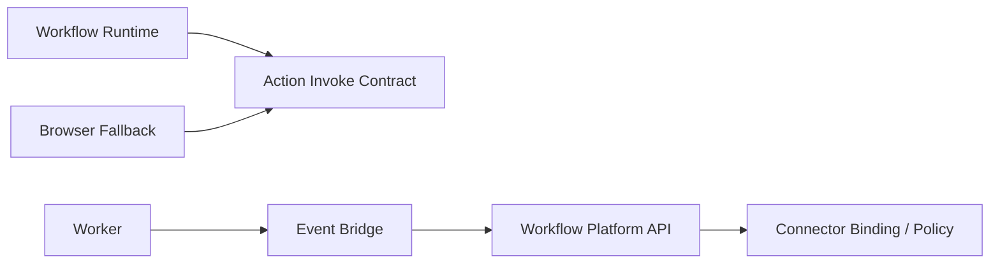

# 02 Architecture

## Context & current state
- 当前 repo 仍是 provider-centric 兼容层，没有正式的 connector/action 层。
- `T-012` 已锁定：
  - `workflow-platform-api` 统一命令和查询
  - `workflow-runtime` 持有状态机
  - `worker` 持有 continuation/timer/retry 执行
- 本子包必须避免把 connector 设计成“带外部系统能力的第二个 runtime”。

## Proposed design

### Core definitions
| Concept | Responsibility | Explicitly not responsible for |
|---|---|---|
| `ConnectorDefinition` | 描述某个外部系统的能力集、auth type、event shape、action catalog | workflow orchestration |
| `ConnectorBinding` | 将 workspace/project 与具体 connector 实例、secret ref、policy 绑定 | runtime state transitions |
| `ActionDefinition` | 一个可调用的外部副作用能力单元，如 create/update/send/query | workflow node scheduling |
| `EventBridge` | 将外部事件归一化为 workflow trigger/input | 直接修改 workflow state machine |
| `BrowserFallbackProfile` | 在无稳定 API 时提供浏览器自动化 fallback 配置 | 成为默认接入路径 |

### Action catalog boundary
- connector-backed actions 与 platform-native actions 不共用同一个 catalog。
- connector-backed actions:
  - 归属 `ConnectorDefinition`
  - 其治理依赖 connector identity、binding、secret、policy context
- platform-native actions:
  - 归属 executor/capability 层
  - 不依赖 connector binding 才能成立
- 但两者共享统一的 invoke contract 形状，首版可抽象为：
  - `action_ref`
  - `input_schema`
  - `side_effect_class`
  - `timeout_policy`
  - `idempotency_key`
- 这样可以统一 runtime 的调用形状，而不混淆 catalog 所属与治理边界。

### Interaction map

### Ownership rules
- `workflow-platform-api`:
  - 管 connector binding 的创建、审批、策略评估
  - 不直接执行业务状态推进
- `workflow-runtime`:
  - 决定何时调用 action
  - 不拥有 connector secret、policy registry
- `worker`:
  - 承接异步 retry、event pull、callback continuation
  - 不决定 action 是否被允许
- `EventBridge`:
  - 负责把外部事件映射为标准 trigger/input
  - 不直接写 workflow state
- `BrowserFallbackProfile`:
  - 只作为 action execution fallback 配置
  - 不负责 event ingestion fallback，也不替代 `EventBridge`

### Governance location
| Concern | Owner |
|---|---|
| secret reference ownership | control plane / platform API |
| connector binding approval | control plane / policy layer |
| action allow/deny evaluation | platform API before runtime invoke |
| runtime execution retry | worker + runtime protocol |

### Why connector is not executor/provider
- executor 是 workflow 内部的节点执行单元，围绕 run/node progression 工作。
- connector 是对外系统能力与身份的治理层，提供 action/event surfaces。
- provider-sample 属于旧兼容体系，不能直接升级成 connector registry 而不重定义治理、auth 和 policy。

### Why catalogs stay separate but invoke contracts align
- 如果 connector-backed actions 和 platform-native actions 共用同一个 catalog，后续很容易重新把 connector 混成 executor/provider 变体。
- 但如果连 invoke contract 都不统一，runtime 又会被迫为每类 action 维护不同调用路径。
- 因此首版采用：
  - catalog 分离
  - invoke contract 对齐

### Why browser fallback is not a first-class runtime
- browser fallback 解决的是“没有稳定 API 但必须执行 action”的问题。
- 它应当作为 `ActionDefinition` 的一种执行后备，而不是 workflow 节点编排器。
- 如果把 browser fallback 提升为主执行路径，会绕过 connector catalog 与 policy 设计。

### EventBridge transport boundary
- `EventBridge` 先冻结 ownership 和 handoff：
  - 外部事件先进入 `EventBridge`
  - `EventBridge` 负责归一化
  - 归一化结果统一交给 `workflow-platform-api`
  - `worker` 可以承接 poll/subscription/callback 的后台执行
- `webhook-first` 还是 `poll-first` 属于后续实施选择，不在本子包冻结。

### Candidate object inventory
- `ConnectorDefinition`
- `ConnectorBinding`
- `ConnectorSecretRef`
- `ActionDefinition`
- `ActionBinding`
- `EventSubscription`
- `BrowserFallbackProfile`

### Explicit exclusions
- 不定义具体第三方连接器。
- 不定义 GUI for secrets/policy。
- 不改变 `T-012` 的 runtime/worker/platform API ownership。

## Data migration (if applicable)
- Migration steps:
  - 先冻结 definitions 和 governance ownership
  - 后续 implementation task 再落 registry/binding schema
- Backward compatibility strategy:
  - 旧 provider path 可继续存在，不要求与 connector layer 同期迁移
- Rollout plan:
  - 在教学/控制台主线稳定后再进入外部系统能力接入

## Non-functional considerations
- Security:
  - connector binding 与 action execution 必须可审计
  - secret refs 不能泄漏到 runtime logs
- Reliability:
  - 失败重试由 worker/runtime protocol 协调
  - browser fallback 需要明确超时、重试和人工介入边界

## Risks and rollback strategy

### Primary risks
- connector 和 executor/node 概念混叠
- event bridge 越界成第二 ingress/runtime
- browser fallback 被当作万能集成方式

### Rollback strategy
- 如果 objects 过多，先保留 `ConnectorDefinition + ConnectorBinding + ActionDefinition + EventBridge`
- 如果 policy 粒度过细，先保留 binding-time approval 和 invoke-time allow/deny 两层
- 如果 browser fallback 风险过高，先只允许 read-only/query actions 使用

## Open questions
- 当前无高影响开放问题；后续若继续细化，优先进入 connector registry/binding schema、invoke DTO 和 policy 粒度，而不是重开 catalog 与 EventBridge ownership 边界
