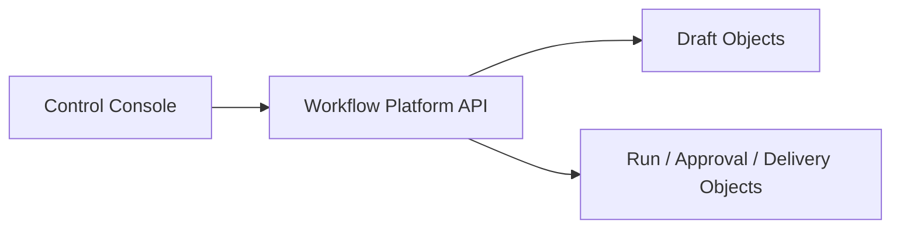

# 02 Architecture

## Context & current state
- 当前 repo 的前端是 Expo/RN chat surface，不适合承接高密度治理台。
- `T-012` 规定控制台所有查询必须走 `workflow-platform-api`。
- `T-013` 和归档后的 `T-017` 已经给出 Draft、Approval、Run、Delivery 的正式对象和首个 historical sample validation 场景，控制台首期应围绕这些对象提供治理能力。

## Proposed design

### Technology stack
| Layer | Decision | Why |
|---|---|---|
| App shell | `React + Vite + TypeScript` | 独立 Web app，避免把控制台变成第二后端 |
| Routing | `TanStack Router` | 适合内部工具的嵌套路由与 loader-style data dependencies |
| Data fetching | `TanStack Query` | 统一 query key、缓存、失效和 polling/SSE fallback |
| UI contract | 复用 repo 现有 `ui/` token/contract，按 Web 落地 | 共享 contract，不强求 RN/Web 重组件复用 |

### Route groups
| Route group | Purpose | Primary object |
|---|---|---|
| `/runs` | 运行观测与恢复 | `WorkflowRun`, `WorkflowNodeRun`, `DeliveryTarget` |
| `/approvals` | 待审队列与证据查看 | `ApprovalRequest`, `Artifact`, `ActorProfile` |
| `/drafts` | draft lineage、校验、发布风险查看 | `WorkflowDraft`, `DraftRevision`, `RecipeDraft` |
| `/studio` | spec-first 编辑与 conversational intake | `WorkflowDraft` |

### Page priorities
| Page | Goal | Required view model |
|---|---|---|
| `Runboard` | 查看运行、阻塞点、node progression、delivery 状态 | run summary, node timeline, blocker summary, target summary |
| `Approval Inbox` | 查看待审条目、证据、决策入口 | approval queue, evidence preview, approver context |
| `Draft Inspector` | 查看 draft revisions、结构化 diff、校验结果、风险状态 | draft overview, revision diff, validation summary, publishability state |
| `Workflow Studio` | 创建/编辑 spec，发起 conversational intake，查看只读 DAG 预览 | draft editor DTO, validation errors, generated DAG preview, revision compare summary |

### Workflow Studio scope
- Includes:
  - 结构化 spec editor
  - conversational intake 面板
  - mixed editing（AI 提议 + 人工修订）
  - validation summary
  - 轻量 `revision compare`
  - read-only DAG preview
- Excludes:
  - drag-and-drop canvas
  - merge/conflict 协作编辑
  - connector binding screens
  - full policy/registry administration

### Query boundary

#### Rules
- control console 不直连 runtime、DB、Redis、Convex。
- 所有页面只依赖 `workflow-platform-api` 暴露的 query DTO。
- 如果需要实时刷新，优先使用 polling/SSE via API，而不是自建旁路数据源。

### View-model dependencies
| Page | Authoritative sources |
|---|---|
| `Runboard` | `WorkflowRun`, `WorkflowNodeRun`, `ApprovalRequest`, `DeliveryTarget` |
| `Approval Inbox` | `ApprovalRequest`, `Artifact`, `ActorProfile` |
| `Draft Inspector` | `WorkflowDraft`, `DraftRevision`, `RecipeDraft` |
| `Workflow Studio` | `WorkflowDraft`, `DraftRevision` |

### Why not `Next.js`
- 当前控制台不需要 SSR 或 server components 作为核心价值。
- 仓库已经会有独立 `workflow-platform-api`，没必要再在前端框架中长一层 BFF。
- 当前优先级是 query consistency、运行治理和复杂表单/详情页，不是公开 Web 页面或营销站。

### Why not canvas-first
- 首期关键问题是对象模型、审计和治理边界，不是图形编辑交互。
- canvas-first 会迫使团队在 schema 稳定前先定义复杂交互，容易打散主线。
- read-only DAG preview 足够支撑对 workflow 结构的检查。

### Explicit exclusions
- 不定义 Artifact Explorer 独立主导航；如需展示 artifact，先嵌入 Runboard/Approval/Draft 页面上下文中。
- 不定义完整 registry、policy、secret admin。
- 不定义移动端管理台或 RN/Web 大规模组件共享。

## Data migration (if applicable)
- Migration steps:
  - 先冻结控制台 view model 依赖
  - 后续实现任务按 query DTO 落 `workflow-platform-api`
- Backward compatibility strategy:
  - chat surface 保持现状，不与控制台争夺入口
- Rollout plan:
  - 先交付 Runboard / Approval / Draft Inspector
  - 再补 Studio 的 mixed editing 体验

## Non-functional considerations
- Performance:
  - 列表和详情页优先一致性与可观测性，不追求 SSR
- Collaboration:
  - draft 编辑先依赖 revision awareness，而不是乐观实时协作
- Accessibility:
  - 以 dense information UI 为主，保持键盘操作和清晰状态反馈

## Risks and rollback strategy

### Primary risks
- 控制台 scope 被拉成全量后台系统
- 页面绕开正式对象模型，开始直接消费 projection convenience fields
- Studio 被过早拉向 canvas/editor 产品

### Rollback strategy
- 如果 IA 过大，优先保住 `Runboard + Approval Inbox + Draft Inspector`
- 如果 query DTO 复杂度过高，先收缩为详情页与关键列表，不做全量筛选
- 如果 Studio 复杂度过高，先只保留 Draft Inspector + conversational intake

## Open questions
- 当前无高影响开放问题；后续若继续细化，优先进入 query DTO、页面分栏和组件层级，而不是重开首批 IA 与 Studio scope 决策
