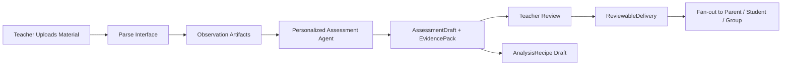

# 02 Architecture

## Context & current state
- 教学场景是 `T-011` 的首个验证样本，不只是验证 workflow substrate，还要验证探索型 agent 的收敛过程。
- `T-018` 已提供：
  - `Artifact`
  - `ApprovalRequest` / `ApprovalDecision`
  - `ActorProfile` / `ActorMembership`
  - `AudienceSelector`
  - `DeliverySpec` / `DeliveryTarget`
- `T-013` 已提供：
  - `WorkflowDraft`
  - `RecipeDraft`
  - publish/gating 边界

## Proposed design

### Scenario flow

### Node responsibilities
| Node | Responsibility | Formal output |
|---|---|---|
| Upload | 接收原始教学材料、作业、课堂观察输入 | source artifact |
| Parse interface | 将原始材料转换为结构化观察与上下文 | observation artifacts |
| Personalized assessment agent | 进行受控探索、生成草稿与证据 | `AssessmentDraft`, `EvidencePack`, optional `AnalysisRecipe draft` seed |
| Teacher review | 审核结论、修改表述、决定是否交付 | `ApprovalDecision`, reviewed `AssessmentDraft` |
| Delivery | 将审核后结果按受众生成交付对象并投递 | `ReviewableDelivery`, `DeliveryTarget` updates |

### Convergence contract
| Object | Purpose | Must include |
|---|---|---|
| `AssessmentDraft` | 结构化评估草稿 | `subject_ref`, `subject_type`, findings, strengths, concerns, recommended actions |
| `EvidencePack` | 证据包 | source artifact refs, observation refs, supporting excerpts, confidence notes |
| `ReviewableDelivery` | 可审核可交付的视图对象 | `presentation_ref`, audience type, approved content slots, exclusions/redactions |
| `AnalysisRecipe draft` | 可复用分析流程草稿 | step sequence, evidence dependency, assumptions, reviewer notes |

### Platform vs scenario boundary
- 平台层只要求 `AssessmentDraft` 有正式评估对象锚点：
  - `subject_ref`
  - `subject_type`
- 平台层只要求 `ReviewableDelivery` 有正式呈现锚点：
  - `presentation_ref`
- 教学场景中的 learner、group、teacher internal、parent、student 只是这些平台通用字段在验证样本中的具体取值，不构成平台默认基准。

### Why the agent is “exploratory but convergent”
- agent 可以在 node 内进行多步分析、比对与假设生成。
- 但对外正式产物不能是自由聊天文本，只能是：
  - `AssessmentDraft`
  - `EvidencePack`
  - `ReviewableDelivery`
  - `AnalysisRecipe draft`
- 任何未收敛的内部思路都不直接进入交付或 capability 复用。

### Parse interface contract
| Input | Output | Notes |
|---|---|---|
| uploaded material set | normalized source artifact refs | 原始材料登记 |
| source artifacts | observation artifacts | 结构化观察，不承诺 parser internals |
| optional metadata | parsing warnings / quality notes | 供 review 和 agent 参考 |

### Review rules
- `AssessmentDraft` 在教师 review 通过前不能直接转为 delivery。
- `EvidencePack` 必须可追溯到 source/observation artifacts。
- `ReviewableDelivery` 必须按受众类型做内容裁剪；教学场景可以让 teacher internal view 比 parent/student view 更完整，但这属于场景映射，不是平台基线。
- `AnalysisRecipe draft` 只能在 review 之后进入“可晋升”状态。

### Team and audience rules
| Concern | Rule |
|---|---|
| workspace collaborators | 可直接加入 workflow team，按角色参与 review 或编辑 |
| temporary collaborators | 先创建 `ActorMembership(pending_confirmation)`，确认后才能参与 review 或收件 |
| parent/student/group audience | 通过 `AudienceSelector` 解析为 `DeliveryTarget` |
| fan-out | 一个 reviewed delivery spec 可以解析出多个 delivery targets |

### Delivery rules
- `DeliverySpec` 绑定：
  - audience selector
  - required approved artifacts
  - redaction / view policy
- `DeliveryTarget` 只有在：
  - approver 通过
  - audience resolution 成功
  - target membership 有效
  时才进入 `ready`

### Explicit exclusions
- 不定义 parser 或 agent prompt 的内部实现。
- 不定义家长端/学生端具体页面或 channel payload。
- 不定义完整教学 rubric 库，只定义正式对象的最小槽位。

## Data migration (if applicable)
- Migration steps:
  - 先冻结场景 contract
  - 后续由实现任务把场景落为 workflow template/version 和 executor interfaces
- Backward compatibility strategy:
  - 场景运行状态仍可投影回 `/v0` timeline
- Rollout plan:
  - 先以单条场景 workflow 验证平台原语
  - 稳定后再扩成更多教学模板

## Non-functional considerations
- Safety/review:
  - review gate 是正式边界，不可绕过
- Traceability:
  - delivery 必须能回溯到 approved draft 和 evidence pack
- Reusability:
  - recipe draft 只在 evidence 可追溯且 review 完成后才允许晋升

## Risks and rollback strategy

### Primary risks
- agent 仍以自由文本为主输出
- review 被做成可选步骤
- audience/fan-out 规则只停留在口头描述，没有对象绑定

### Rollback strategy
- 若 agent 收敛不稳定，先允许 deterministic assessment pipeline 生成同样的 four-object contract
- 若 fan-out 规则过深，先保留 parent / student / group 三类 audience，不扩展 channel-level 细节
- 若 team 模型过于复杂，先限制 temporary collaborators 只参与 review，不直接收件

## Open questions
- 当前无高影响开放问题；后续若继续细化，优先进入 `AssessmentDraft` / `ReviewableDelivery` 的字段级 schema，而不是把教学特例回写成平台基线
