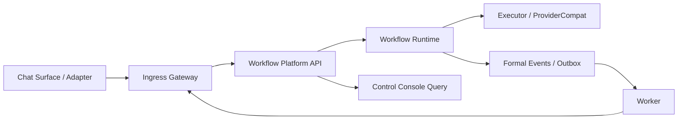
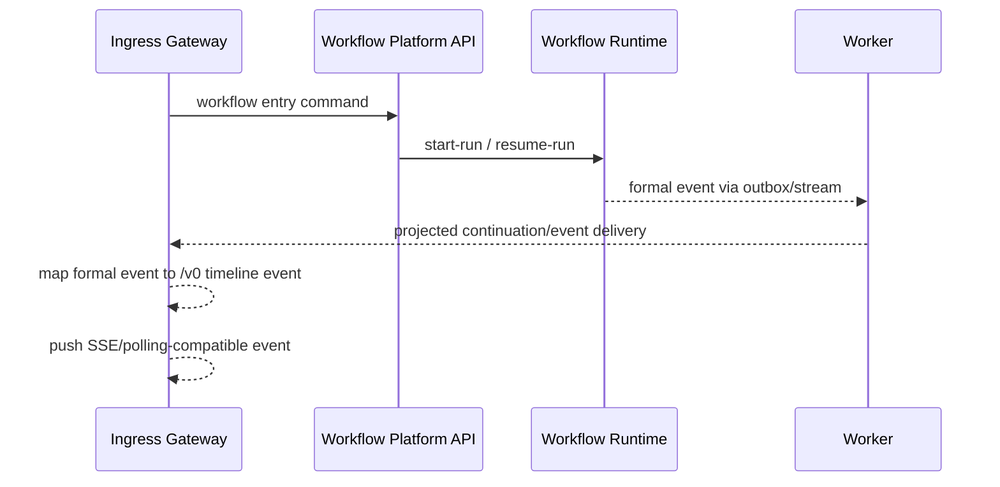

# 02 Architecture

## Context & current state
- 当前 `apps/gateway` 同时承担：
  - `/v0/ingest`, `/v0/interact`, `/v0/events`, `/v0/stream`, `/v0/timeline`
  - session / sticky routing / provider invoke
  - timeline push 与兼容交互事件
- 当前 `apps/worker` 已具备：
  - outbox retry
  - Redis stream consumer
  - replay / dead-letter / e2e smoke 基础
- 当前 DB SSOT 已是 Prisma/Postgres，但正式对象仍局限在：
  - `Session`
  - `TimelineEvent`
  - `ProviderRun`
  - `OutboxEvent`
  - `UserContextCache`
- 当前系统仍是 ingress-centric；本子包的目标是把平台骨架切到 workflow-centric，同时不破坏 `/v0` 兼容层。

## Proposed design

### Service responsibility map



### Service responsibility matrix
| Service | Responsible for | Explicitly not responsible for |
|---|---|---|
| `ingress-gateway` | `/v0` ingress, session/timeline compatibility, user interaction callback, final chat/timeline projection | workflow template management, run orchestration, continuation state machine |
| `workflow-platform-api` | unified command entry, workflow/template/version query, run start/resume command dispatch, control-console query surface | node execution, timer loop, direct `/v0` projection |
| `workflow-runtime` | run/node state machine, executor invocation, wait/resume protocol, formal event production | final `/v0` projection, UI-facing query shaping, background scan loop ownership |
| `worker` | outbox/retry/replay, formal event fan-out, continuation/timer/retry execution by protocol | owning run state machine, gateway-compatible event shaping |

### Command and query paths

#### Command path
1. `chat surface` / adapter sends user input to `ingress-gateway`
2. `ingress-gateway` resolves:
   - legacy provider path, or
   - workflow entry path
3. For workflow entry path, `ingress-gateway` calls `workflow-platform-api`
4. `workflow-platform-api` validates template/version/run request and issues internal command to `workflow-runtime`
5. `workflow-runtime` creates/advances `WorkflowRun` + `WorkflowNodeRun`
6. `workflow-runtime` invokes executor(s) and emits formal events
7. formal events are delivered through outbox/stream and projected back by `ingress-gateway`

#### Query path
1. `control-console` reads only from `workflow-platform-api`
2. `workflow-platform-api` aggregates platform metadata + run state for control-plane views
3. `control-console` does not query runtime or DB directly in `P1`

### Minimal interface freeze

#### External `/v1` surface
- `GET /v1/workflows`
- `GET /v1/workflows/{workflowId}`
- `POST /v1/runs`
- `GET /v1/runs/{runId}`
- `POST /v1/runs/{runId}/resume`
- `GET /v1/approvals`
- `GET /v1/artifacts/{artifactId}`

#### Internal command surface
- `POST /internal/runtime/start-run`
- `POST /internal/runtime/resume-run`
- `POST /internal/executors/{executorId}/invoke`

#### Kept `/v0` surface
- `POST /v0/ingest`
- `POST /v0/interact`
- `POST /v0/events`
- `GET /v0/stream`
- `GET /v0/timeline`

### Formal events and timeline projection path



#### Formal event contract boundary
- `workflow-runtime` owns formal event semantics:
  - run created
  - node scheduled
  - node waiting_input
  - node waiting_approval
  - node completed
  - run completed/failed/cancelled
  - artifact produced
  - approval requested/decided
- `ingress-gateway` owns compatibility projection semantics:
  - `task_question`
  - `task_state`
  - assistant/system message cards
  - existing `TimelineEvent` envelope

### Continuation / retry / timer / backfill path

#### Ownership rule
- `workflow-runtime` defines:
  - resumable states
  - continuation token schema
  - retryable vs non-retryable state transitions
  - timeout/approval/user-input wake-up semantics
- `worker` executes:
  - timer scan
  - retry scheduling
  - continuation trigger
  - replay/backfill commands

#### Why not runtime loop
- runtime service should stay focused on deterministic state transitions and command handling
- background scanning/retry/timer work already has a host in `worker`
- reusing `outbox + stream + replay` gives observability and operational consistency

#### Why not worker owns everything
- worker should not decide business state transitions
- run/node state machine logic must remain in runtime for testability and coherency
- worker executes protocol; runtime owns meaning

### P1 minimal object set and state boundaries

#### Frozen object set
- `WorkflowTemplate`
- `WorkflowTemplateVersion`
- `WorkflowRun`
- `WorkflowNodeRun`
- `Artifact`
- `ApprovalRequest`
- `ApprovalDecision`

#### State boundaries
```ts
type WorkflowRunStatus =
  | "created"
  | "running"
  | "waiting_input"
  | "waiting_approval"
  | "paused"
  | "completed"
  | "failed"
  | "cancelled";

type WorkflowNodeRunStatus =
  | "created"
  | "scheduled"
  | "running"
  | "waiting_input"
  | "waiting_approval"
  | "paused"
  | "completed"
  | "failed"
  | "cancelled";

type ApprovalRequestStatus =
  | "pending"
  | "approved"
  | "rejected"
  | "expired"
  | "cancelled";

type ArtifactState =
  | "draft"
  | "validated"
  | "published"
  | "superseded"
  | "archived";
```

#### Why `AgentDefinition` is excluded from `P1`
- `AgentDefinition` requires trigger/identity/secret binding/activation semantics
- these semantics belong to a later governance layer, not the first skeleton freeze
- `P1` only needs enough formal objects to create, track, pause/resume, approve, and project workflow runs

### `/v0` compatibility mapping
| Existing `/v0` concept | New platform meaning | Final owner |
|---|---|---|
| `/v0/ingest` workflow hit | gateway forwards workflow entry command to `workflow-platform-api` | `ingress-gateway` |
| `runId` | northbound-compatible handle for `WorkflowRun` | `workflow-platform-api` / `workflow-runtime` |
| `task_question` | projection of `waiting_input` node state | `ingress-gateway` |
| `task_state` | projection of node/run progress | `ingress-gateway` |
| `providerId` | compat/provider label for northbound clients | compat layer |
| timeline event | compatibility projection of formal event | `ingress-gateway` |

### Interfaces & contracts
- Allowed dependencies:
  - `control-console` -> `workflow-platform-api`
  - `ingress-gateway` -> `workflow-platform-api`
  - `workflow-platform-api` -> `workflow-runtime`
  - `workflow-runtime` -> executor / outbox / formal events
  - `worker` -> formal event substrate + continuation protocol
- Forbidden dependencies:
  - `control-console` -> runtime direct query
  - `ingress-gateway` -> runtime direct command for workflow start in `P1`
  - `workflow-runtime` -> direct `/v0` timeline shaping
  - `worker` -> business state transitions

## Data migration (if applicable)
- Migration steps:
  - preserve existing `/v0` tables
  - add new workflow/data plane tables via Prisma SSOT later in `data-plane` subtask
  - keep timeline as compatibility projection, not authoritative workflow store
- Backward compatibility strategy:
  - `/v0` contract remains unchanged
  - existing `provider-plan` path can coexist while workflow path is introduced
- Rollout plan:
  - first define platform skeleton
  - then add data plane models
  - then wire ingress to platform path behind design-backed implementation

## Non-functional considerations
- Security/auth/permissions:
  - `workflow-platform-api` is the policy gate for control-plane commands
  - `ingress-gateway` remains the external/public ingress surface for chat-compatible flows
- Performance:
  - `P1` favors correctness and clear boundaries over minimizing internal network hops
  - `Hybrid` target allows future async scaling without changing public API ownership
- Observability (logs/metrics/traces):
  - all formal events must carry `runId`, `nodeRunId`, `traceId`
  - all compatibility projections must preserve linkage back to formal event source

## Risks and rollback strategy

### Primary risks
- gateway remains a hidden orchestrator
- runtime directly leaks chat/timeline concerns
- worker grows into a second runtime
- `P1` object scope expands before skeleton stabilizes

### Rollback strategy
- if new workflow path is unstable, `ingress-gateway` can continue routing to legacy provider path only
- if continuation protocol is unstable, disable async continuation and keep run advancement command-driven
- if formal event projection is unstable, restrict projection to minimal `task_state` and system messages while preserving `/v0` availability

## Open questions
- internal command path naming may still be cosmetically simplified later, but ownership will not change
- formal event envelope will be further specified in the `workflow-contracts` subtask, but producer/consumer ownership is fixed here
